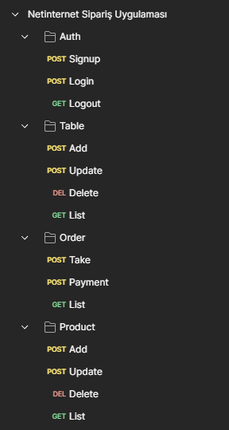

# Zenithar

Proje adını, iş, ticaret, çalışma ve ticaretle ilişkilendirilen bir konsepti yansıtması için Skyrim oyunundan ilham alarak "Zenithar" olarak belirledim.

## Açıklama

MVC (Model-View-Controller) yapısını temel aldım ve backend tarafında bu yapıyı en etkili şekilde kullanmaya odaklandım. Bu sayede kodun düzenli, sürdürülebilir ve genişletilebilir olmasını sağladım.

### Fonksiyonlar

- CRUD (Create - Read - Update - Delete) işlemleri yapıldı

- **Masa İşlemleri:**
  - Masa ekleme, silme, güncelleme ve listeleme işlemleri gerçekleştirilebilir.

- **Ürün İşlemleri:**
  - Ürün ekleme, silme, güncelleme ve listeleme işlemleri uygulanabilir.

- **Sipariş Alma ve Ödeme:**
  - Sipariş alma ve ödeme seçenekleri kullanıcıya sunulmuştur.

- **Güvenlik Önlemleri:**
  - Kullanıcı kimlik doğrulama sistemi eklenmiştir. Sadece admin yetkisine sahip kullanıcılar, belirli işlemleri gerçekleştirebilir.

- **Kullanıcı Yetkileri:**
  - Admin haricindeki kullanıcılar belirli işlevleri gerçekleştiremezler, bu da sistem güvenliğini arttırır.

- **Monitoring ve Loglama Detayları:**
  - **Prometheus ve Grafana**: Proje performansını ve kaynak kullanımını izlemek için kullanılmıştır.
  - **Loki**: Logları toplamak, saklamak ve sorgulamak için kullanılmıştır.

# Kullanılan Teknolojiler

Bu projede aşağıdaki teknolojiler kullanılmıştır:

- [Go](https://golang.org/) - Programlama Dili
- [Fiber](https://gofiber.io/) - Web Framework
- [GORM](https://gorm.io/) - ORM (Object-Relational Mapping) kütüphanesi
- [Docker](https://www.docker.com/) - Konteynerleşme Platformu
- [Prometheus](https://prometheus.io/) - İzleme ve Uyarı Sistemi
- [NGINX](https://www.nginx.com/) - Web Sunucusu
- [Loki](https://grafana.com/loki) - Log Aggregation Sistemi

# Postman

